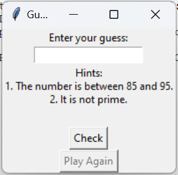
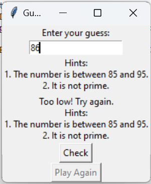
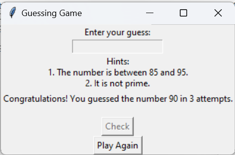

# Guessing Game Program

## Hello Users!!!

Welcome to the guessing game task. This task is created using Python programming language. An additional feature is included which provides hints indicating the range in which the number lies and whether it is prime or not. Below are the images demonstrating the deployed code.

### Table of Contents
- [Initial Page](#initial-page)
- [Wrong Input](#wrong-input)
- [Right Guess](#right-guess)

### Initial Page

### Wrong Input

### Right Guess

